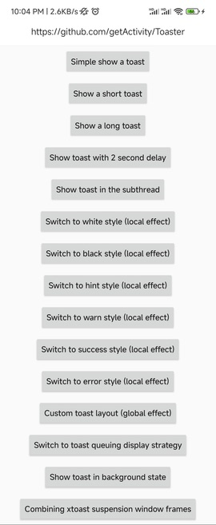
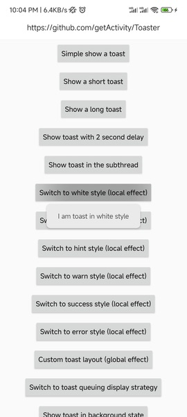
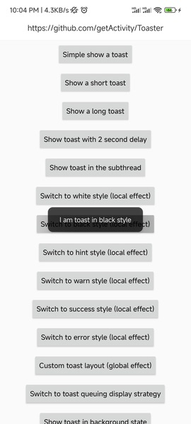
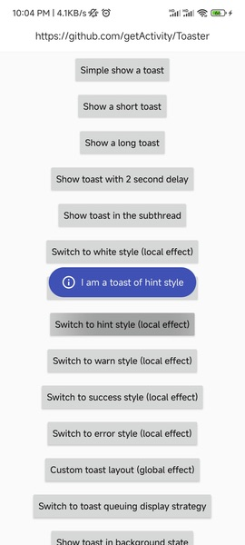
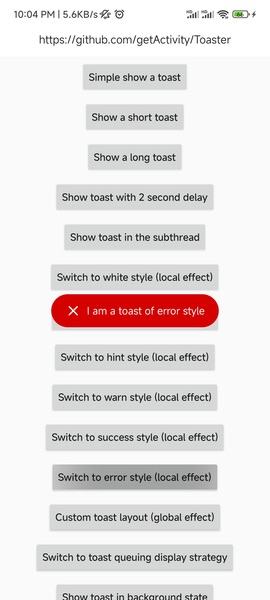

# [English Doc](README-en.md)

# Toast Framework

* Project address: [Github](https://github.com/getActivity/Toaster)

* [Click here to download demo apk directly](https://github.com/getActivity/Toaster/releases/download/12.2/Toaster.apk)

  

  

 

#### Integration steps

* If your project Gradle configuration is in `7.0` below, needs to be in `build.gradle` file added

```groovy
allprojects {
    repositories {
        // JitPack remote repository：https://jitpack.io
        maven { url 'https://jitpack.io' }
    }
}
```

* If your Gradle configuration is `7.0` or above, needs to be in `settings.gradle` file added

```groovy
dependencyResolutionManagement {
    repositories {
        // JitPack remote repository：https://jitpack.io
        maven { url 'https://jitpack.io' }
    }
}
```

* After configuring the remote warehouse, under the project app module `build.gradle` add remote dependencies to the file

```groovy
android {
    // Support JDK 1.8
    compileOptions {
        targetCompatibility JavaVersion.VERSION_1_8
        sourceCompatibility JavaVersion.VERSION_1_8
    }
}

dependencies {
    // Toast framework：https://github.com/getActivity/Toaster
    implementation 'com.github.getActivity:Toaster:12.2'
}
```

#### Initialize the framework

```java
public class XxxApplication extends Application {

    @Override
    public void onCreate() {
        super.onCreate();

        // Initialize the toast framework
        Toaster.init(this);
    }
}
```

#### Framework API introduction

```java
// Show toast
Toaster.show(CharSequence text);
Toaster.show(int id);
Toaster.show(Object object);

// Toast is displayed in debug mode
Toaster.debugShow(CharSequence text);
Toaster.debugShow(int id);
Toaster.debugShow(Object object);

// Delayed display of toast
Toaster.delayedShow(CharSequence text, long delayMillis);
Toaster.delayedShow(int id, long delayMillis);
Toaster.delayedShow(Object object, long delayMillis);

// Show short toast
Toaster.showShort(CharSequence text);
Toaster.showShort(int id);
Toaster.showShort(Object object);

// Show long toast
Toaster.showLong(CharSequence text);
Toaster.showLong(int id);
Toaster.showLong(Object object);

// Custom display toast
Toaster.show(ToastParams params);

// Cancel toast
Toaster.cancel();

// Set toast layout (global effect)
Toaster.setView(int id);

// Set toast style (global effect)
Toaster.setStyle(IToastStyle<?> style);
// Get toast style
Toaster.getStyle()

// Determine whether the current framework has been initialized
Toaster.isInit();

// Set toast strategy (global effect)
Toaster.setStrategy(IToastStrategy strategy);
// Get toast strategy
Toaster.getStrategy();

// Set toast center of gravity and offset
Toaster.setGravity(int gravity);
Toaster.setGravity(int gravity, int xOffset, int yOffset);

// Set Toast interceptor (global effect)
Toaster.setInterceptor(IToastInterceptor interceptor);
// Get Toast interceptor
Toaster.getInterceptor();
```

## [Please click here to view frequently asked questions](HelpDoc-en.md)

#### Comparison between different Toast frameworks

|  Function or detail  | [Toaster](https://github.com/getActivity/Toaster) |[ AndroidUtilCode-ToastUtils ](https://github.com/Blankj/AndroidUtilCode)| [Toasty](https://github.com/GrenderG/Toasty) |
| :----: | :------: |  :-----: |  :-----: |
| Corresponding version |  12.2 |  1.30.6  |  1.5.0  |
|    Number of issues   |  [](https://github.com/getActivity/Toaster/issues)  |[](https://github.com/Blankj/AndroidUtilCode/issues)|  [](https://github.com/GrenderG/Toasty/issues)  |
|  Framework pack size | 31 KB | 500 KB | 50 KB |
| Framework maintenance status| 维护中 | 停止维护 | 停止维护 |
| Call code trace |  ✅  |  ❌  |  ❌  |
| Support calling display in sub-threads |  ✅  |  ✅  |  ❌  |
| Support setting partial Toast style |  ✅  |  ❌  |  ❌  |
| Support setting global Toast style |  ✅  |  ❌  |  ❌  |
| Support Toast Instant display |  ✅  |  ✅  |  ❌  |
| Support Toast queue display |  ✅  |  ❌  |  ✅  |
| Support Toast delayed display |  ✅  |  ❌  |  ❌  |
| Solve the problem that Toast crashes on Android 7.1 |  ✅  |  ✅  |  ❌  |
| Compatible with the problem that the Toast cannot be displayed after the permission of the notification bar is turned off |  ✅  |  ✅  |  ❌  |
| Adapted to Android 11, the problem that Toast cannot be displayed in the background |  ✅  |  ❌  |  ❌  |

#### Introduction to calling code positioning function

* The framework will output the location of the code called by Toast in the log printing, so that developers can directly click Log to locate which class and line of code is called, which can greatly improve the efficiency of our troubleshooting, especially if the Toast content is returned by the server, I believe that no one will reject such a function.


#### Introduction to the problem of Toast crashing on Android 7.1

* This problem is caused by the addition of the WindowToken verification mechanism in Android 7.1, and this WindowToken is generated by NotificationManagerService. This WindowToken has a certain timeliness, and when the main thread of the application is blocked, WindowManager will calibrate the WindowToken when addingView However, the WindowToken has expired, and addView will throw an exception at this time.

* Google fixed this problem in Android 8.0. The repair method is very simple and rude, which is to directly capture this exception. The repair idea of ​​the framework is similar to that of Google, but the repair method is different, because the framework cannot directly modify the system source code, so it is directly Exceptions are caught by means of Hook.

#### Introduction to the problem that Toast cannot be displayed after the notification bar permission is turned off

* This problem occurs because the display of the native Toast needs to pass through NMS (NotificationManagerService) to addView to the Window, and there is a `static final boolean ENABLE_BLOCKED_TOASTS = true` field in NMS. When the constant value is true, it will Trigger NMS to check the application notification bar permission. If there is no notification bar permission, then this Toast will be intercepted by NMS and output `Suppressing toast from package` log information. Xiaomi phones do not have this problem because they are Change the value of the `ENABLE_BLOCKED_TOASTS` field to `false`, so the check on the permission of the notification bar will not be triggered, and why do I know this? Because I once confirmed this with a MIUI engineer.

* There are two ways for the framework to handle this problem. First, determine whether the current application is in the foreground state. If so, use a custom WindowManager instead of Toast to display it. If the current application is in the background state, it will use the INotificationManager interface in Hook Toast. The package name parameter passed by the enqueueToast method is changed to `android` to deceive NotificationManagerService, because NotificationManagerService has whitelisted the application with `android` package name, the system automatically permits. one thing to note is that, this method has expired on Android 10 and has been included in the reflection blacklist by the system, but the good news is that after checking and comparing the source code of NotificationManagerService, this problem (the problem of not being able to play Toast in the foreground after closing the notification bar permission) It has been fixed on Android 10.0, so the framework only goes to Hook INotificationManager when Android 9.0 and below and the notification bar permission is turned off. In addition, I also found the official code submission record about this piece:[ Always allow toasts from foreground apps ](https://cs.android.com/android/_/android/platform/frameworks/base/+/58b2453ed69197d765c7254241d9966ee49a3efb), you can take a look if you are interested, there is another question, if you want to still display Toast in the background in Android 10 and later versions, please ensure the notification bar permission or floating window permission of the application It is turned on. If you must require 100% display of Toast in the background state, please ensure that the application has the floating window permission, because on some mobile phones, even if there is a notification bar permission, it cannot display Toast in the background. For example, I use The HarmonyOS 2.0 test will not work, so it depends on how the product is considered.

#### Android 11 cannot display Toast in the background

* When we change the targetSdkVersion to 30 and above, we will find a problem. If the application is in the background process, and the Toast style of our application happens to be customized, then calling the show method of Toast in these cases will Surprisingly, Toast is not displayed. Please note that this problem is not a bug, but Android 11 prohibits this behavior. It is also noted in [Toast | Android Developers](https://developer.android.com/reference/android/widget/Toast#setView(android.view.View)), and it is not recommended to customize the style of Toast, and also tagged the `Toast.setView` method as `deprecated api`.

* So how do we solve this problem? Is it really impossible to use custom style Toast? My answer is: Google only said that it cannot display custom Toast in the background, but it does not mean that it cannot be done in the foreground. The idea of ​​adapting the framework is that in the case of Android 11, it will first judge the current Toast Whether the application is in the foreground or the background, if it is in the foreground, it will display a custom-style Toast, if it is in the background, it will display a system-style Toast (by discarding the custom style to ensure that the Toast can be displayed normally), This can not only meet the requirements of Android 11, but also maximize the benefits of customized Toast.

* It is worth noting that Toaster is currently the first and only framework of its kind to adapt to this feature of Android 11.

#### Framework highlights

* Take the lead: the first toast framework adapted to Android 11, developer do not need to care about the adaptation process

* No permissions required: Regardless of whether the notification bar permission is granted or not, it does not affect the pop-up of the toast

* Strong compatibility: Deal with the historical legacy of native Toast crashes in Android 7.1

* Powerful functions: Toast can be popped up regardless of primary and secondary threads, and resource id and int type can be automatically identified

* Easy to use: just pass in the text, and the duration of the toast display will be automatically determined according to the length of the text

* Best performance: use lazy loading mode, only create Toast when displaying, do not take up Application startup time

* Best experience: Displaying the next Toast will cancel the display of the previous Toast, so that it can be displayed immediately

* Global unity: You can initialize the Toast style in the Application to achieve a once-and-for-all effect

#### How to replace the existing native Toast in the project

* Right-click the pop-up menu in the project, Replace in path, check the Regex option, and click Replace

```text
Toast\.makeText\([^,]+,\s*(.+),\s*[^,]+\)\.show\(\)
```

```text
Toaster.show($1)
```

* Replace the package name

```text
import android.widget.Toast
```

```text
import com.hjq.toast.Toaster
```

*  Then search globally and manually replace some that have not been replaced successfully

```text
Toast.makeText
new Toast
```

#### Author's other open source projects

* Android middle office: [AndroidProject](https://github.com/getActivity/AndroidProject)

* Android middle office kt version: [AndroidProject-Kotlin](https://github.com/getActivity/AndroidProject-Kotlin)

* Permissions framework: [XXPermissions](https://github.com/getActivity/XXPermissions)  

* Network framework: [EasyHttp](https://github.com/getActivity/EasyHttp)

* Title bar framework: [TitleBar](https://github.com/getActivity/TitleBar)

* Floating window framework: [XToast](https://github.com/getActivity/XToast)

* Shape view framework: [ShapeView](https://github.com/getActivity/ShapeView)

* Language switching framework: [Multi Languages](https://github.com/getActivity/MultiLanguages)

* Gson parsing fault tolerance: [GsonFactory](https://github.com/getActivity/GsonFactory)

* Logcat viewing framework: [Logcat](https://github.com/getActivity/Logcat)

* Android version guide: [AndroidVersionAdapter](https://github.com/getActivity/AndroidVersionAdapter)

* Android code standard: [AndroidCodeStandard](https://github.com/getActivity/AndroidCodeStandard)

* Android resource summary：[AndroidIndex](https://github.com/getActivity/AndroidIndex)  

* Android open source leaderboard: [AndroidGithubBoss](https://github.com/getActivity/AndroidGithubBoss)

* Studio boutique plugins: [StudioPlugins](https://github.com/getActivity/StudioPlugins)

* Emoji collection: [emoji pa c shadow](https://github.com/getActivity/EmojiPackage)

* China provinces json: [ProvinceJson](https://github.com/getActivity/ProvinceJson)

* Markdown documentation：[MarkdownDoc](https://github.com/getActivity/MarkdownDoc)  

## License

```text
Copyright 2018 Huang JinQun

Licensed under the Apache License, Version 2.0 (the "License");
you may not use this file except in compliance with the License.
You may obtain a copy of the License at

   http://www.apache.org/licenses/LICENSE-2.0

Unless required by applicable law or agreed to in writing, software
distributed under the License is distributed on an "AS IS" BASIS,
WITHOUT WARRANTIES OR CONDITIONS OF ANY KIND, either express or implied.
See the License for the specific language governing permissions and
limitations under the License.
```